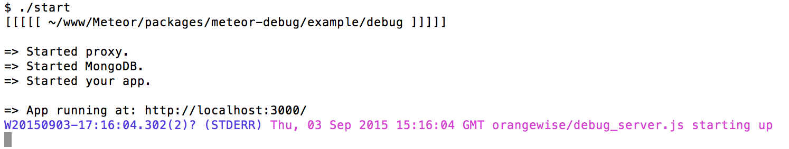
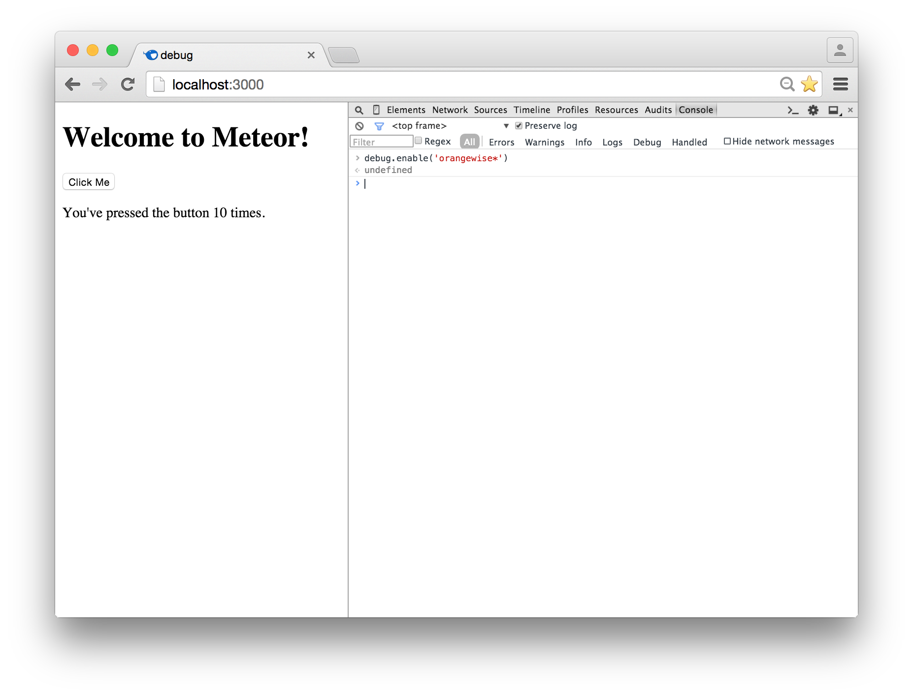
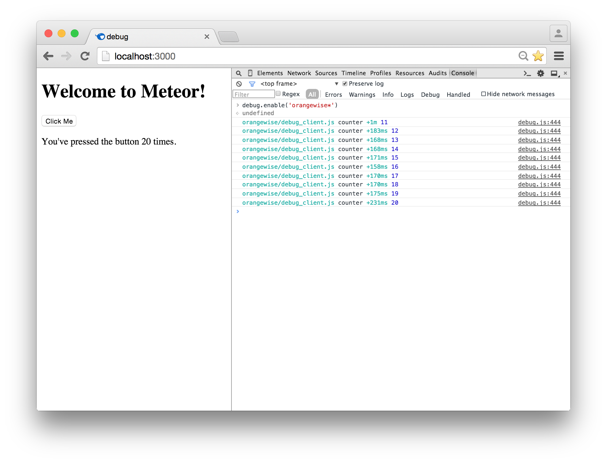

# Example Meteor App

Give start script execution rights

```
chmod +x start
```

Start example app

```
./start
```

The start script runs the meteor app with DEBUG set to orangewise*. This means that all the debug messages in the orangewise namespace on the server will be visible in the server console:

```
DEBUG=orangewise* meteor

```

# Server output




# Enable client output




# Client output


